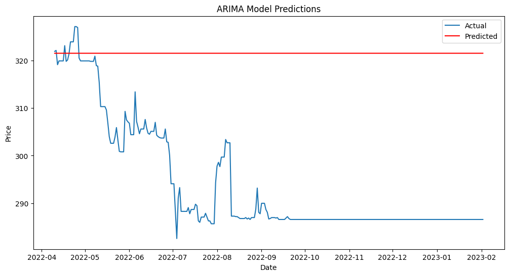

# DSEBD_Prediction
This repository build for analysis Grameenphone Limited (GPL) , Walton and Orion Pharmaceutical  data for DSEBD Prediction.

## Analysis
#### Bolinger Band

This is Bolinger Band plot for GPL. This plot shows the upper and lower band of GPL stock price. The upper band is 2 standard deviation above the 20-day moving average and the lower band is 2 standard deviation below the 20-day moving average. The bands automatically widen when volatility increases and narrow when volatility decreases. The bands also automatically adjust to price changes. The bands are a dynamic indicator that change as the market changes.


#### RSI


This is RSI plot for GPL. The RSI is a momentum oscillator that measures the speed and change of price movements. The RSI is displayed as an oscillator (a line graph that moves between two extremes) and can have a reading from 0 to 100. The RSI is considered overbought when above 70 and oversold when below 30. Signals can also be generated by looking for divergences, failure swings and centerline crossovers.


#### ARIMA


This is ARIMA plot for GPL. The ARIMA model is a generalization of the simpler AutoRegressive Moving Average (ARMA) model. Both of these models are fitted to time series data either to better understand the data or to predict future points in the series. The ARIMA model adds the notion of integration. This means that the model can incorporate the use of differencing of raw observations (e.g. subtracting an observation from an observation at the previous time step) in order to make the time series stationary. This is a key aspect of ARIMA models.

### Dataset
The dataset is collected from [DSEBD](https://dsebd.org/) and [investing.com](www.investing.com) . The dataset contains 5 years data of GPL. The dataset is in csv format. The dataset is in the dataset folder.


### Requirements
* Python 3.10

### Installation

 
```sh
$ git clone
$ cd DSEBD_Prediction
$ pip install -r requirements.txt
```

 